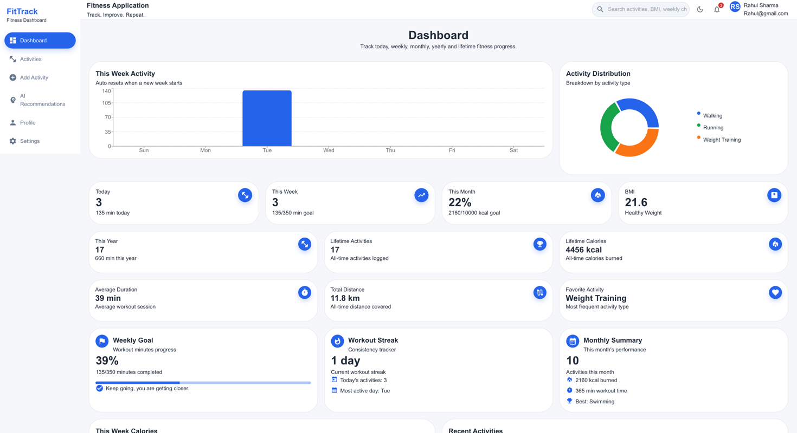
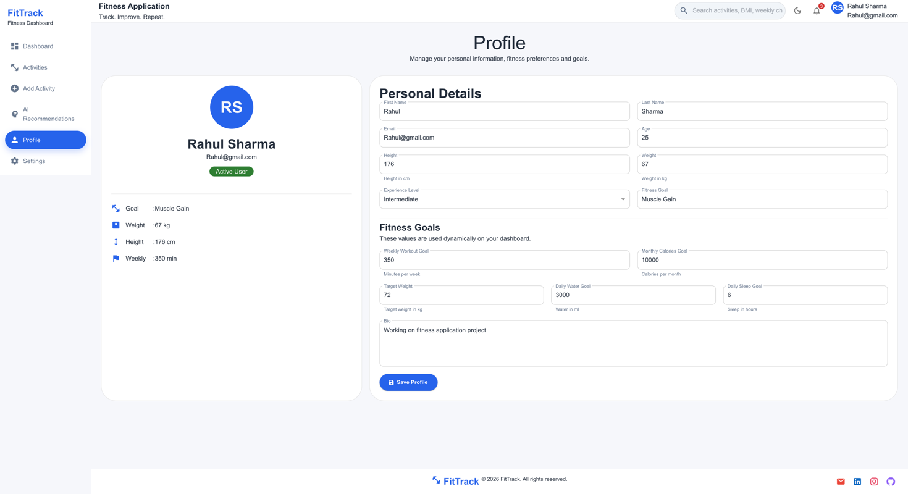
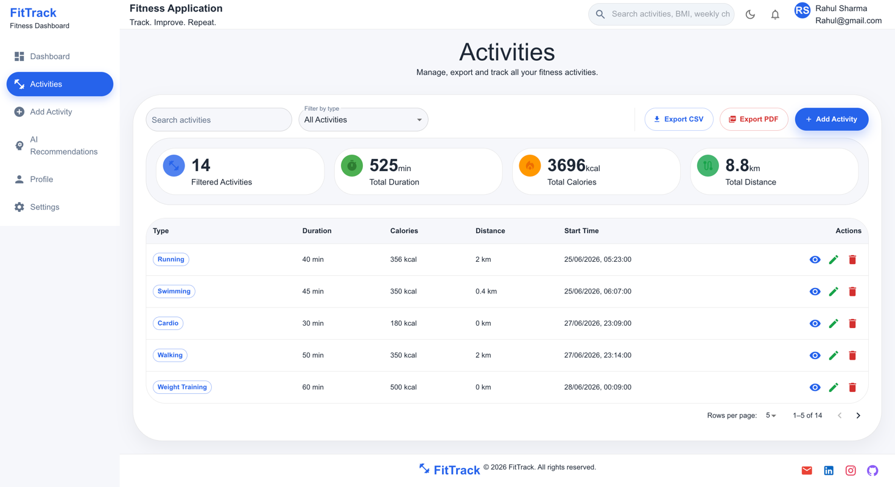
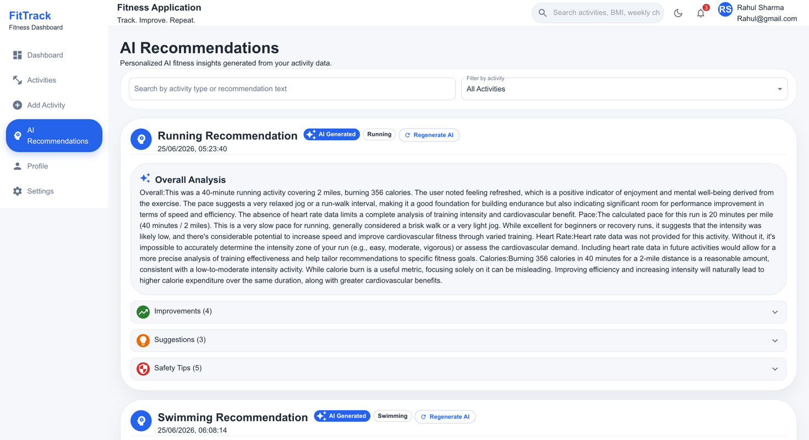
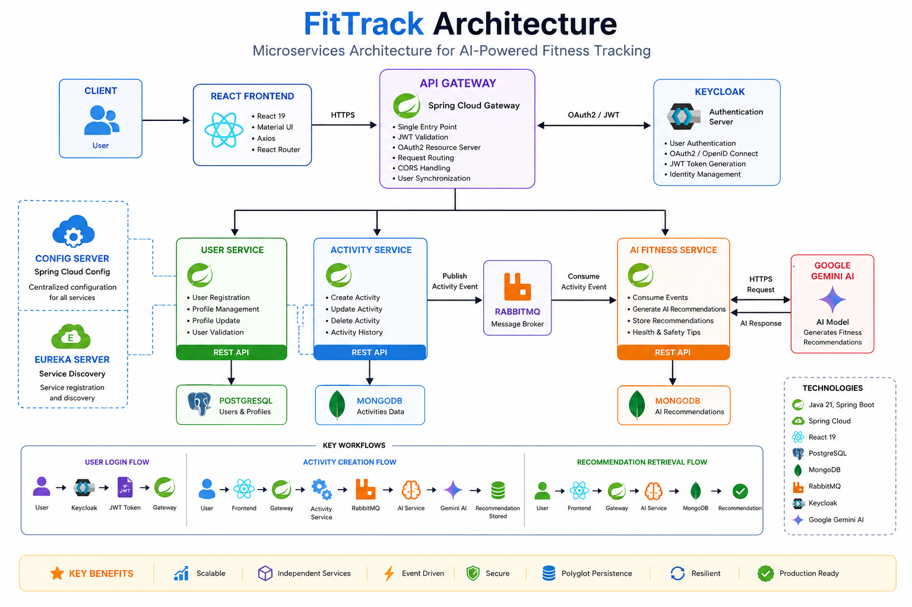

# 🏋️ FitTrack

### AI-Powered Fitness Tracking Platform

FitTrack is a production-style **Full Stack Fitness Tracking Platform** built using **Spring Boot Microservices**, **React**, **Keycloak**, **RabbitMQ**, **MongoDB**, **PostgreSQL**, and **Google Gemini AI**.

The application enables users to securely track fitness activities, manage personal profiles, and receive AI-powered workout recommendations through an event-driven microservices architecture.

---

# 📸 Application Preview

> Screenshots will be added after deployment.

| Login | Dashboard |
|-------|-----------|
|  |  |

| Profile |
|-------|
|  |

| Activities | AI Recommendation |
|------------|-------------------|
|  |  |

---

# ✨ Features

### 🔐 Authentication

- OAuth2 Authentication using Keycloak
- JWT Token Validation
- Secure API Gateway
- Automatic User Registration
- Protected REST APIs

---

### 👤 User Management

- Register User
- View User Profile
- Update Profile
- Delete Profile
- Profile Goal Management

---

### 🏃 Activity Tracking

Users can

- Add Activities
- Update Activities
- Delete Activities
- View Activity History
- Track Workout Duration
- Track Calories Burned
- Store Additional Metrics

Supported Activities

- Running
- Walking
- Cycling
- Swimming
- Gym Workout
- Yoga
- Strength Training

---

### 🤖 AI Recommendation Engine

Whenever an activity is recorded

- Activity is stored in MongoDB
- Activity event is published to RabbitMQ
- AI Service consumes the message
- Gemini AI analyzes the workout
- Personalized recommendations are generated
- Recommendations are stored in MongoDB

---

### 📊 Dashboard

Interactive Dashboard including

- Weekly Activity
- Calories Burned
- Activity Distribution
- AI Recommendations
- Recent Activities

---

### 🎨 Responsive Frontend

- React 19
- Material UI
- Responsive Design
- Dark Theme
- React Router

---

# 🏗 Architecture

> Architecture diagram



📄 Detailed Architecture

👉 [Architecture Documentation](docs/ARCHITECTURE.md)

---

# 🛠 Tech Stack

| Category | Technologies |
|----------|--------------|
| Backend | Spring Boot, Spring Cloud, Spring Security |
| Frontend | React, Vite, Material UI |
| Database | PostgreSQL, MongoDB |
| Authentication | Keycloak, OAuth2, JWT |
| Messaging | RabbitMQ |
| AI | Google Gemini API |
| Build Tools | Maven, npm |

---

# 📂 Project Structure

```text
FitTrack
│
├── configServer/
├── Eureka/
├── gateway/
├── UserService/
├── ActivityService/
├── AI_Fitness_Service/
├── Fitness_Application_Frontend/
│
├── docs/
│
├── README.md
├── LICENSE
├── .gitignore
└── .env.example
```

---

# 🚀 Quick Start

## Clone Repository

```bash
git clone https://github.com/SonuRajput1010/FitTrack.git

cd FitTrack
```

## Start Backend Services

Run the services in the following order

```
1. Config Server

2. Eureka Server

3. User Service

4. Activity Service

5. AI Fitness Service

6. Gateway
```

## Start Frontend

```bash
cd Fitness_Application_Frontend

npm install

npm run dev
```

Frontend

```
http://localhost:5173
```

# 📚 Documentation

Detailed project documentation is available in the **docs** directory.

| Document | Description |
|----------|-------------|
| 📄 [ARCHITECTURE.md](docs/ARCHITECTURE.md) | Complete Microservices Architecture |
| 📄 [API.md](docs/API.md) | REST API Reference |
| 📄 [SETUP.md](docs/SETUP.md) | Local Development Setup |
| 📄 [WORKFLOW.md](docs/WORKFLOW.md) | Complete Request & Event Flow |
| 📄 [DEPLOYMENT.md](docs/DEPLOYMENT.md) | Deployment Guide |

---

# 🔄 System Workflow

### User Authentication

```
User
   │
   ▼
React Frontend
   │
   ▼
Keycloak
   │
JWT Token
   │
   ▼
API Gateway
```

---

### Activity Tracking Workflow

```
React Frontend
        │
        ▼
API Gateway
        │
        ▼
Activity Service
        │
        ▼
MongoDB
        │
Publish Event
        │
        ▼
RabbitMQ
        │
        ▼
AI Fitness Service
        │
        ▼
Google Gemini AI
        │
        ▼
Recommendation Stored
        │
        ▼
MongoDB
```

---

### User Profile Workflow

```
Frontend
     │
     ▼
Gateway
     │
     ▼
User Service
     │
     ▼
PostgreSQL
```

---

# 🔐 Security

FitTrack follows production-style security practices.

Implemented security features include:

- OAuth2 Authentication
- JWT Token Validation
- Keycloak Identity Provider
- Protected REST APIs
- API Gateway Authentication
- Automatic User Synchronization
- Environment Variable Based Secret Management

---

# ⚙ Environment Configuration

Each microservice maintains its own configuration using environment variables.

Configuration files are provided as:

```
.env.example
```

No secrets or credentials are stored inside the repository.

---

# 🌐 Service Ports

| Service | Port |
|----------|------|
| Config Server | 8888 |
| Eureka Server | 8761 |
| Gateway | 8080 |
| User Service | 8081 |
| Activity Service | 8082 |
| AI Fitness Service | 8083 |
| React Frontend | 5173 |
| Keycloak | 8181 |

---

# 🚀 Deployment

The project is designed to support deployment on modern cloud platforms.

Planned deployment targets include:

- Railway
- Render
- AWS
- Azure
- Google Cloud Platform

Deployment documentation will be available in:

```
docs/DEPLOYMENT.md
```

---

# 📈 Future Improvements

- Docker Compose Support
- Kubernetes Deployment
- GitHub Actions CI/CD
- Prometheus Monitoring
- Grafana Dashboard
- Centralized Logging
- Distributed Tracing
- Email Notifications
- Push Notifications

---

# 🤝 Contributing

Contributions, issues and feature requests are welcome.

If you'd like to contribute:

1. Fork the repository
2. Create a new feature branch
3. Commit your changes
4. Push the branch
5. Open a Pull Request

---


Backend Developer | Full Stack Java Developer

📧 Email

sonusinghrajput9189@gmail.com

🔗 GitHub

https://github.com/SonuRajput1010

🔗 LinkedIn

(https://www.linkedin.com/in/sonu-rajput1012)

---

# 📄 License

This project is licensed under the **MIT License**.

See the LICENSE file for more details.

---

# ⭐ Support

If you found this project helpful, please consider giving it a **Star ⭐** on GitHub.

It motivates future improvements and helps others discover the project.

---

<p align="center">

Made with ❤️ using Spring Boot, React, RabbitMQ, Keycloak and Google Gemini AI.

</p>

# 👨‍💻 Author

## Sonu Singh Rajput
